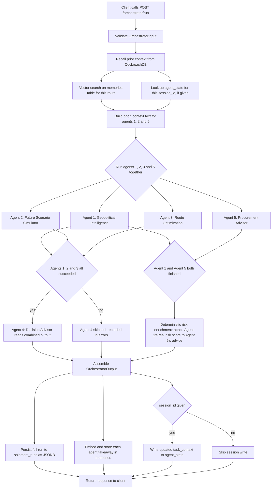
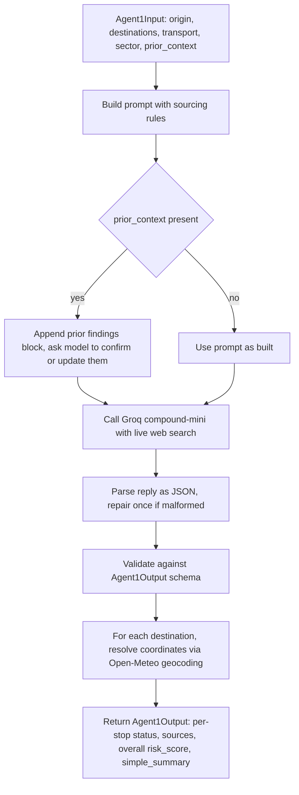
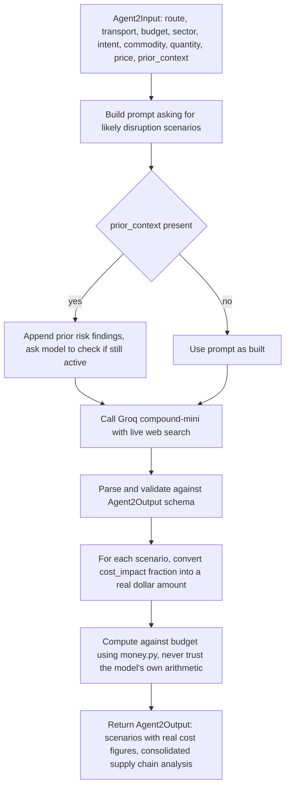
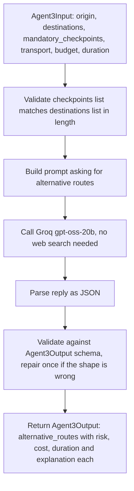
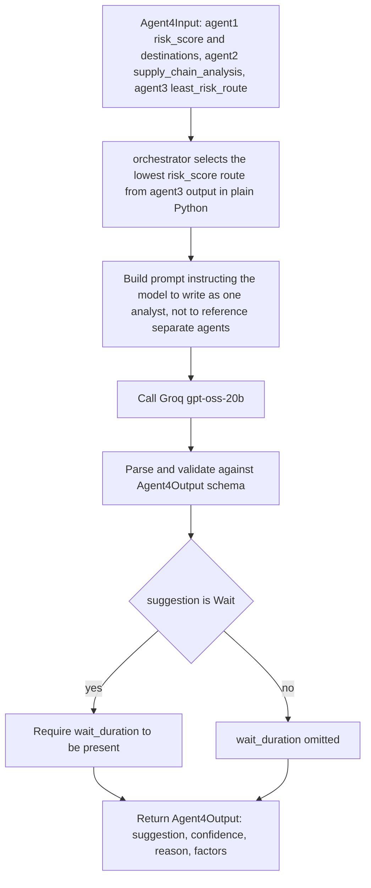
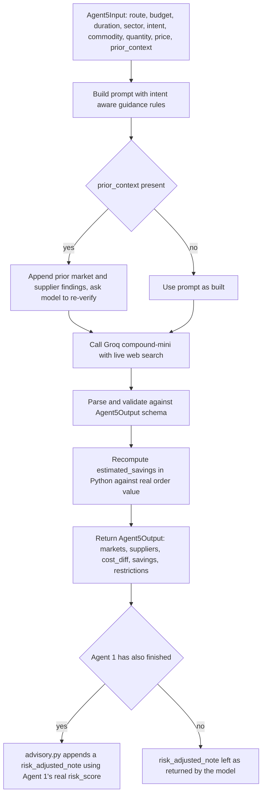

# Sentinel architecture

This document covers two things. First, a flowchart for the overall orchestration and one flowchart for each of the five agents, so the exact path a request takes through the system is visible at a glance. Second, a full explanation of how CockroachDB is used, since it is the persistent memory layer the whole system depends on.

Every diagram below is written in Mermaid. GitHub renders Mermaid blocks directly in a README or markdown file, so no external tool is needed to view them, and they can be pasted into the Mermaid Live Editor for anyone who wants to zoom, pan, or edit them interactively.

## Overall orchestration flow



Agent one, two, three, and five are independent of each other, so they run inside the same `asyncio.gather` call. Agent four is not independent, since it reads the combined output of the first three, so it only starts once they finish, and it is skipped entirely if any of them failed, since it would otherwise be reasoning over incomplete data. Persisting the run and updating session state both happen after the response has already been computed, and neither one can fail the request itself. A CockroachDB outage degrades the system to a stateless run with no memory, not to a broken response.

## Agent 1, Geopolitical Intelligence



This is the only agent whose findings are geocoded, since it is the one whose output is meant to be plotted on a map. Coordinates are never requested from the model itself, since a language model has no reliable way to produce accurate latitude and longitude, so that step is handled separately by a dedicated geocoding call after the model responds.

## Agent 2, Future Scenario Simulator



The model is asked for a fraction such as 0.12 for a twelve percent cost impact, and that fraction is then multiplied against the shipment's actual stated budget in plain Python. This exists because a language model asked to independently produce both a percentage and a dollar figure will sometimes produce two numbers that do not agree with each other, since it is generating text, not doing arithmetic against a checked value.

## Agent 3, Route Optimization



Agent three does not use a search capable model, since combining and scoring routes from the constraints already given does not require live information the way agents one, two, and five do. This keeps it off the shared search model rate limit budget entirely and makes it noticeably cheaper per call.

## Agent 4, Decision Advisor



The choice of which alternative route counts as the least risky one is made deterministically in Python by taking the minimum risk score from agent three's output, not by asking the model to pick. The model only writes the final narrative verdict around a route that has already been selected by code.

## Agent 5, Procurement Advisor



Agent five runs in parallel with agent one and does not wait for it. The risk aware note that ties procurement advice to actual route risk is only appended once agent one's result becomes available, as a small non model step, so this never adds latency to agent five's own turnaround time.

## How CockroachDB is used

Three tables carry the entire persistence layer. All three are created by `schema.sql`.

### memories

Stores one row per piece of agent takeaway text, embedded as a vector.

```sql
CREATE TABLE memories (
  id UUID PRIMARY KEY DEFAULT gen_random_uuid(),
  run_id UUID NOT NULL,
  agent_name STRING NOT NULL,
  route_key STRING NOT NULL,
  content STRING NOT NULL,
  embedding VECTOR(384) NOT NULL,
  created_at TIMESTAMPTZ DEFAULT now()
);
CREATE VECTOR INDEX memories_embedding_idx ON memories (embedding);
CREATE INDEX memories_route_key_idx ON memories (route_key);
```

Every time the orchestrator finishes a run, each agent's plain language summary is turned into a 384 dimension embedding using a small local model, `BAAI/bge-small-en-v1.5` served through fastembed, and written here alongside the run it came from. No external embedding API is called and no cost is incurred per embedding, since the model runs inside the same process.

Before the agents run on a new request, `recall_context` queries this table for the same route. The query first filters by `route_key`, a normalized string built from the origin and destination list, and only then ranks the remaining rows by vector distance against the current request's own embedded query text. This two step approach, an exact filter followed by a vector search inside that filtered set, is what keeps recall relevant. Without the route key filter, a vector search alone could surface a memory from a completely different shipment that happens to use similar words, which is not useful context for the model reasoning about this specific route.

```sql
SELECT content FROM memories
WHERE route_key = $1
ORDER BY embedding <-> $2
LIMIT 3;
```

The vector index means this ranking does not require scanning every row in the table to compute distance against each one. As the table grows across many demo runs, or in a real deployment across many shipments, the index keeps this query fast instead of degrading linearly with table size, which is the entire point of using a database with native distributed vector support instead of holding embeddings in memory or reaching out to a separate vector store that would need to be kept in sync with the relational data by hand.

The recalled snippets are injected back into agent one, two, and five's prompts as `prior_context`, along with an explicit instruction to verify rather than blindly trust what was found before, since conditions on a real shipping route can change between calls. This is what makes the memory active rather than passive. A prior write that is never read back into reasoning is just a log. A prior write that changes what the next call actually considers is memory in the sense that matters for an agent.

### shipment_runs

Stores the complete input and complete output of every orchestrator call as JSONB, with a handful of columns pulled out for fast filtering.

```sql
CREATE TABLE shipment_runs (
  id UUID PRIMARY KEY DEFAULT gen_random_uuid(),
  session_id UUID NOT NULL,
  origin STRING,
  destinations STRING[],
  sector STRING,
  intent STRING,
  commodity_name STRING,
  budget STRING,
  risk_score FLOAT8,
  suggestion STRING,
  request_json JSONB NOT NULL,
  response_json JSONB NOT NULL,
  errors JSONB,
  created_at TIMESTAMPTZ DEFAULT now()
);
CREATE INDEX shipment_runs_session_idx ON shipment_runs (session_id, created_at DESC);
```

Nothing here is summarized or dropped. The full `OrchestratorInput` and full `OrchestratorOutput` are stored exactly as they were sent and returned, so any past run can be replayed or audited precisely as it happened, and the pulled out columns such as `risk_score` and `suggestion` exist purely so a dashboard or judge reviewing the data can filter and sort without parsing JSONB on every row.

### agent_state

Tracks session continuity across repeated calls from the same client.

```sql
CREATE TABLE agent_state (
  session_id UUID PRIMARY KEY,
  last_run_id UUID,
  task_context JSONB,
  updated_at TIMESTAMPTZ DEFAULT now()
);
```

When a request includes a `session_id`, its stored `task_context`, which holds the last origin, destinations, budget, and verdict for that session, is read before the agents run and written back after, using a single atomic upsert.

```sql
INSERT INTO agent_state (session_id, last_run_id, task_context, updated_at)
VALUES ($1, $2, $3, now())
ON CONFLICT (session_id) DO UPDATE
SET last_run_id = $2, task_context = $3, updated_at = now();
```

This is what lets a second call in the same session reference the first one directly, for example noticing that a client asked about the same route with a different budget than before, without needing to run a fresh vector search to reconstruct that context.

### Connection handling and failure behavior

Every call opens a short lived connection using `pg8000`, a pure Python driver that speaks CockroachDB's wire protocol, and closes it immediately after. This keeps the code simple and is sufficient for demo scale traffic. A pooled connection, reused across warm invocations, is the natural next step if this were scaled past a demo.

Every read and every write in `memory.py` is wrapped so that a CockroachDB failure never breaks the response already computed for the user. A failed recall simply returns an empty context, and a failed write is logged and skipped. The system is designed so that CockroachDB being unreachable degrades Sentinel to a stateless single request tool, not to a broken one.
